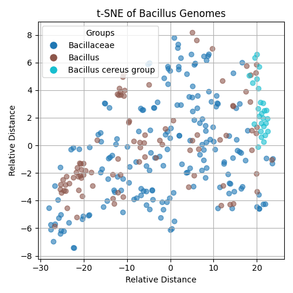

## kmer2vec Python Notebook

Based on https://gitlab.igem.org/2022/software-tools/tsinghua/. The code was optimized to consume less RAM and work faster. The results are slightly different from it, so use it with caution.

'seqdump.txt' with original fasta sequences was too large to be uploaded.

Plot however can be rebuilt based on the saved files, if needed.

